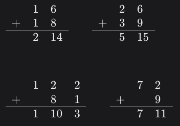

# 16+18=214
## 7 Kyu

For this kata you will have to forget how to add two numbers.

In simple terms, our method does not like the principle of carrying over numbers and just writes down every number it calculates :-)

You may assume both integers are positive integers.

### Examples

 