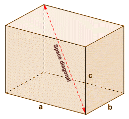
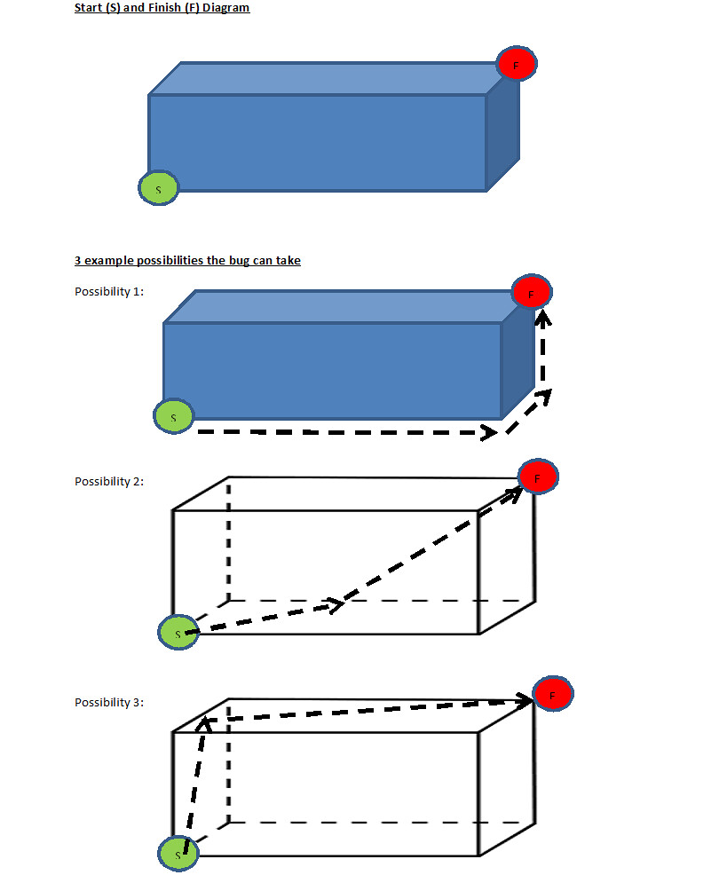

# Bugs Life
## 7 kyu

A bug lives in a world which is a cuboid and has to walk from one corner of the cuboid to the opposite corner (see the picture below).

Google 'Cuboid Space Diagonal'

### Task

Define a function which takes 3 arguments: the length a , width b, and height c of the bug's "world", and finds the shortest distance needed to walk from start to finish. The dimensions will be positive numbers.

Note: The bug cannot fly and has to maintain contact with a surface at all times but can walk up walls.

### Example

a=1, b=2, c=3: distance=4.242640687119285

### Hints

Hint 1: Consider how many different routes can be made to get from start to finish. If stuck for where to start, click here for general guidance.

Hint 2: Consider using paper and opening up the net of a cuboid (and think if there are multiple ways this can be viewed) and play around with it to find the shortest length.

