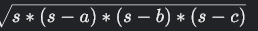
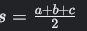

# Heron's formula
## 7 Kyu

Write function heron which calculates the area of a triangle with sides a, b, and c (x, y, z in COBOL).

Heron's formula:

where

Output should have 2 digits precision.
