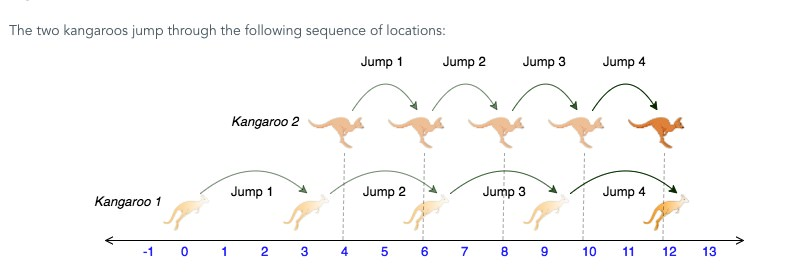

# Jumping Kangaroos
## 7 kyu

Adapted from here, with less terrible instructions and a couple tweaks.

Two kangaroos are jumping on a line. They start out at different points on the line, and jump in the same direction at different speeds. Your task is to determine whether or not they'll ever land in the same spot at the same time (you'll just have to suspend disbelief for a moment and accept that two kangaroos, for the purpose of this kata, can occupy the same space at the same time :)

Your function is given four arguments (kanga1, rate1, kanga2, rate2); the first kangaroo's starting point, the first kangaroo's speed, the second kangaroo's starting point, and the second kangaroo's speed.

Return true if the above conditions are met, else false. Starting location and speed may vary wildly. The first kangaroo will usually start behind the second one and travel faster, but not always. Starting locations may be negative, but speeds will always be > 0.

### Example:
```
kangaroo(kanga1 = 0, speed1 = 3, kanga2 = 4, speed2 = 2)=> true //they meet on their fourth jump
```


#### Other examples:
```
kangaroo(0,2,5,3)=> false //the first kangaroo starts behind, moves slower, and never catches up
```
Brute force solutions are possible (and not discouraged), but you'll save yourself a lot of waiting time if you don't go that route :)