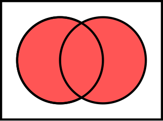

# Playing with Sets : Union
## 7 Kyu

Set objects are new JavaScript built-in objects defined since ECMAScript 2015

A Set lets you store unique values of any type. It comes with some useful methods like `.add`, `.clear`, `.has` ... **BUT** some "Set operations" are missing, like . . .

### Union



Two sets can be "added" together. The union of A and B, denoted by A ∪ B, is the set of all things that are members of either A or B.

#### Examples:
```
  {1, 2} ∪ {1, 2} = {1, 2}.
  {1, 2} ∪ {2, 3} = {1, 2, 3}.
  {1, 2, 3} ∪ {3, 4, 5} = {1, 2, 3, 4, 5}
```

### Task

Create function `union` getting 2 sets as arguments and returning a **new Set** as result of union of these 2 sets.

#### Examples:
```
A = new Set([1,2]);
B = new Set([2,3]);

C = union(A,B) // -> {1,2,3}
```
 

" May the Code be with you ! " 