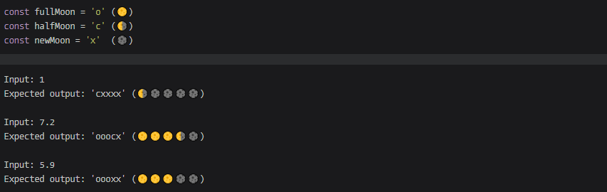

# Simple Moon Rating
## 7 kyu

When you look at movie ratings, you usually see it as decimal numbers representing average of all viewers' votes. While it is very informative, it's not very visually appealing. That's what stars, or in our case- moons, are created for.

Your task is to transform decimal number rating, which is in range 0-10, into 5-moons scale. Your final rating should be rounded to "0.5" (nearest half moon). Input is always valid.
```
Write a function which returns valid rating represented as moons ('o','c','x') in single string.
```
You are given the following values preloaded (the moons in brackets are here just to improve your imagination):

