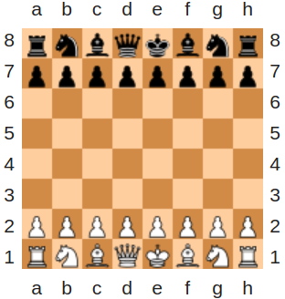

# White or Black?
## 7 kyu

Complete the function that returns the color of the given square on a normal, 8x8 chess board:

### Examples

"a", 8  ==>  "white"
"b", 2  ==>  "black"
"f", 5  ==>  "white"
