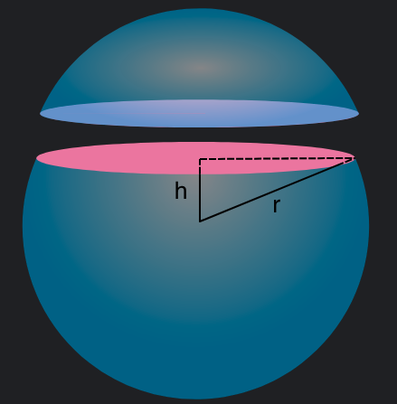

# Some stereometry
## 7 kyu

You will be given a sphere with radius `r`. Imagine that sphere gets cut with a plane, in this case the figure that is made with this cut is a circle. You will also be given the distance `h` between centres of sphere and circle.Your task is to return the surface area of the original sphere,area of circle and perimeter of circle, all of them rounded to 3 decimal places and order must be same as in the description.

