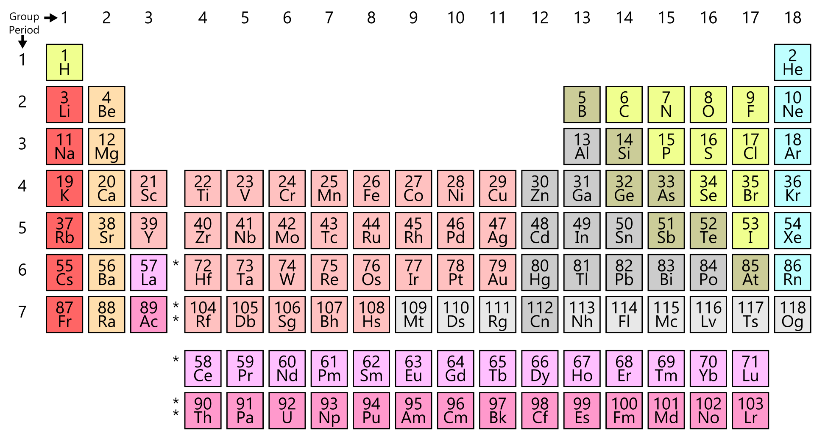

# Identify Best Planet
## 6 kyu

A space agency recently launched a new satellite with the primary goal of identifying the most suitable planet within a given solar system to support human life. The satellite is equipped to scan entire solar systems and add each detected planet to a list. The satellite uses the following format when inputting planets into an array: [elements]_[surface area]. In this format, each element is represented by its chemical symbol from the periodic table. For example, a planet composed of hydrogen (H), oxygen (O), and nitrogen (N), with a surface area of 100 thousand square miles, wouled be labeled as follows:
```
HON_100
```

You will receive a list that includes all the planets in a solar system, as well as an inclusive maximum size that a planet can be for human life. Your task is to identify the planet that possesses all the essential elements for human life while being as large as possible. The required elements for human life are: Hydrogen (H), Carbon (C), Nitrogen (N), Oxygen (O), Phosphorus (P), and Calcium (Ca). These elements are represented as follows:
```
["H", "O", "N", "C", "P", "Ca"]
```
If none of the planets meet the requirements, then return an empty string, "". Finally, multiple planets can contain all of the required elements; in this case, return the planet that is closest to the maximum possible size.

### Example:
```
["OHNCCaP_100", "OHC_200", "OCa_50", "OHCCaP_400", "OHNCCaP_225", "OHCa_250"], 250 --> "OHNCCaP_225"
```
Note:
- Only elements from 1 to 118 are used, and there are no repeating elements on a planet

Periodic Table:
