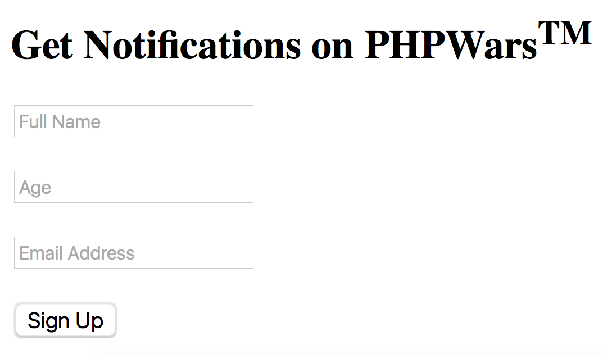
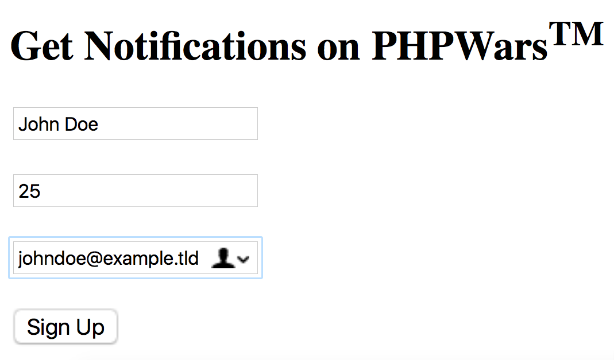
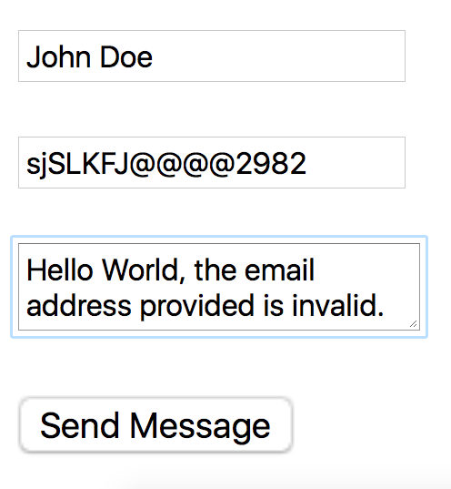
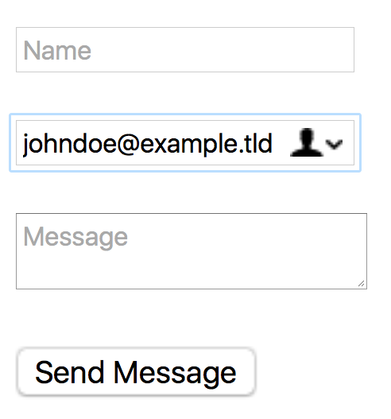
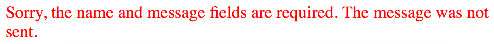
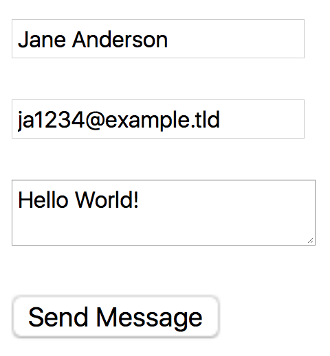
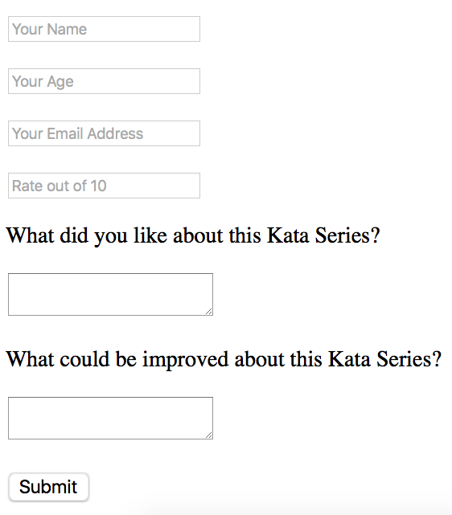

# PHP in Action #3 - HTTP POST Method, Input Sanitation and Input Validation [Fundamentals]
## 6 kyu

### About this Kata Series

"PHP in Action" is a Kata Series authored by donaldsebleung which is specifically aimed at novice PHP programmers who have learnt the basic syntax and features of the PHP programming language in online courses such as Codecademy but do not know how to apply it in real-world situations. Hence, this Kata Series will focus on the practical aspects of PHP such as sending emails, form validation and setting cookies.

This Kata Series assumes that you have already learnt the fundamentals of PHP such as data types (e.g. strings, numbers, booleans), functions and basic OOP. A good indicator that you are ready for this Kata Series is if you can complete Multiply (8kyu) in PHP and the first four Kata in my Object-Oriented PHP Series without hesitation and without referring to external sources in the process. Since real-world PHP is commonly used in conjunction with HTML and CSS (and sometimes even Javascript), you will also be expected to have a basic understanding of the following programming languages. In certain Kata in this Series where form validation is involved, you may also be expected to be familiar with HTML forms, what attributes they have and how they work.

### Lesson

Last lesson, we learned that when your browser sends a request to the server containing the webpage files, it uses the ```GET``` method by default, unless the request was made when an HTML form with the attribute ```method="post"``` was submitted, in which case the ```POST``` method is used instead. We also learned that we could detect which method was used in the web request in PHP by accessing the ```"REQUEST_METHOD"``` key of the ```$_SERVER``` superglobal, which is an associative array.

This lesson, we will learn the basics of handling submitted form data via the HTTP POST method.

#### A Simple Example

Before we start, you may remember from last lesson that it was possible to pass in URL parameters in the following format: ```http://somewebsite.tld/path/to/the/php_file.php?param1=somevalue&param2=someothervalue&param3=yetsomeothervalue```, where ```?``` is the delimiter between the actual URL and the URL parameters and ```&``` is the delimiter between different key/value pairs within the URL parameters. The URL parameters can then be accessed as key/value pairs in the superglobal associative array called ```$_GET```. Similarly, form data submitted through a form with attribute ```method="post"``` can be accessed as key/value pairs in the superglobal associative array called ```$_POST```, where the key is the name attribute of a particular input field and the value is what the user entered into that particular input field. Below is a possible (purely fictional) real-world example:

Timmy is an enthusiastic PHP Developer who wants as many people in the world as possible to learn how to code in PHP, so he has recently decided to start an online service called PHPWars where PHP developers can train on PHP coding exercises and improve upon their PHP coding skills. However, since PHPWars is quite a large project, it is estimated that it will take at least a few months before he can finally get the service live. In order to prevent his potential customers from forgetting about or losing interest in his online project in this time period, he has created an online HTML form on his website so anyone who may be interested in his project can enter their personal details and email address. When the form is submitted, the personal details and email address the customer entered is saved in a database so in the near future, when his project is near completion, he can use his website to automatically send emails to his potential customers to remind them that PHPWars is about to go live. The HTML code he used for his signup form is as follows:
```
<h2>Get Notifications on PHPWars<sup>TM</sup></h2>
<form action="<?php echo htmlspecialchars($_SERVER["PHP_SELF"]); ?>" method="post">
  <p>
    <input type="text" name="name" placeholder="Full Name" />
  </p>
  <p>
    <input type="text" name="age" placeholder="Age" />
  </p>
  <p>
    <input type="email" name="email" placeholder="Email Address" />
  </p>
  <p>
    <input type="submit" value="Sign Up" />
  </p>
</form>
```

... and the form looks something like this:



Firstly, below the ```<h2>``` tags, notice that the opening ```<form>``` tag has two attributes: ```action``` and ```method```. As mentioned before, the ```method``` attribute specifies the method that your browser sends a request to the server containing the webpage files as the form is being submitted, which in this case (and most other cases) is ```"post"```. This means that when the form is submitted, the form data can be accessed as key/value pairs in the ```$_POST``` superglobal and not the ```$_GET``` superglobal. The ```POST``` method is most often used with HTML forms because it has a number of advantages compared to ```GET```: it does not show the submitted information in the URL (which can pose a security issue especially when sensitive information such as passwords are involved) and there is no limit as to how much form data the ```POST``` method can hold (there is a limit as to how much data you can cram into an URL via URL parameters with the ```GET``` method which is summarised here on W3Schools). One of the few exceptions to this rule is when creating a search form where you can safely set the method attribute to ```"get"``` as the search keywords entered into the search form is not sensitive data (and is usually short enough that the ```GET``` data restriction has virtually no effect on the query).

As for the ```action``` attribute of the HTML form, notice that we have PHP code inserted within that attribute, surrounded by PHP script tags (```<?php and ?>```). If you read the PHP code inside those script tags carefully, you will see an echo statement which basically means text is being dynamically printed out into that attribute. You may also notice that what is being printed out looks a little bit weird: ```htmlspecialchars($_SERVER["PHP_SELF"])```. If you don't freak out by that weird-looking code and take a closer look, you will see that it is simply the value ```$_SERVER["PHP_SELF"]``` passed into a function called ```htmlspecialchars()```. As you may remember from previous lessons, the ```$_SERVER``` variable is yet another one of the few superglobals predefined in PHP. The ```$_SERVER``` superglobal contains a key called ```"PHP_SELF"``` which basically contains the relative URL of the current webpage file. For example, let's say that Timmy's website is located at ```http://phpwars.com``` and the current PHP file containing this HTML form is a file called ```index.php``` located at the root directory of the website. ```$_SERVER["PHP_SELF"]``` will then be equal to the relative URL ```"/index.php"``` in that particular PHP file. What ```$_SERVER["PHP_SELF"]``` essentially does in this case is that it will always set the action attribute of the HTML form equal to the path to the current PHP file/script so that when the form is submitted, the form data will always be submitted back into the same page wherever the current PHP script is located. This in turn means that the action attribute of the HTML form will always be a valid URL no matter where this PHP script and HTML form is placed in the website.

Next, take a look at the first three ```<input>``` tags. You will notice that each of them has exactly three attributes, ```type```, ```name``` and ```placeholder```. The ```type``` attribute of an ```<input>``` field specifies the type of form data that goes into each field. In the case of the full name and age of the customer, the type of form data entered into those fields would naturally be plain "text" as there is nothing special about the importance and/or format of a person's name and/or age. As for the email field, Timmy could also have used a plaintext field (```type="text"```) to record the email address but HTML forms also specifically support an ```"email"``` data type which allows for some degree of input validation in the form itself (in some browsers only) before the form data in that field is actually passed into the PHP code. Other possible types of input types include ```"password"``` (which masks all the characters in identical black dots) and ```"radio"``` (where you select exactly one choice out of many).

Another attribute you would have noticed is the ```placeholder``` attribute which is essentially the grey text displayed to the user inside the input fields when they are empty in order to show the user what input is expected.

However, the most important attribute of an ```<input>``` field which makes each input field unique is its ```name``` attribute. As you can see, the first input field has a ```name``` of ```"name"```, the second one ```"age"``` and the third one ```"email"```. The ```name``` attribute is especially important because it is used as the key in the key/value pairs found in the $```_POST``` superglobal when the form data is submitted. Let's say we have a user, John Doe, for example, and he has typed in the following data into the signup form before pressing the "Sign Up" button:



The following would then hold true once John submits the form by pressing on the "Sign Up" button:
```
$_POST["name"] === "John Doe";
$_POST["age"] === "25";
$_POST["email"] === "johndoe@example.tld";
```

Note that form data submitted by a user are **ALWAYS strings**. Even if users entered a number (like in the age field above), the corresponding form data is received as a **STRING**, not a number. Keep that in mind when manipulating form data.

Timmy can then validate, sanitize and manipulate the form data in his PHP script as he wishes. In this case he would probably want to enter and save the form data in his database so he can send automated emails in the near future.

Returning back to the HTML form, you may have wondered where the "Sign Up" button came from and whether it automatically appeared every time you use the ```<form>``` tags. If you are clever enough, you would have noticed that there is fourth ```<input>``` field with only two attributes instead of three. That's right, the ```"Submit"``` (or signup) button is treated as an ```<input>``` field. As you can see, its type attribute is set to ```"submit"``` indicating that it is the button to be pressed in order to submit the form data. Note that a submit button does not have a name attribute as its sole purpose is to submit the form data to the target URL specified by the action attribute of the form itself and therefore does not hold any form data in and of itself. It also does not have a placeholder attribute as nothing is entered into a Submit (or signup) button so no placeholder text has to be displayed to the user to tell them what to enter. However, it does have a value attribute which specifies what the button should read. In this case the value attribute is set to "Sign Up" so in the screenshots above you can see that the text on the submit button reads "Sign Up". Note that the value attribute of the Submit button is optional, if it is omitted, the Submit button reads exactly "Submit" by default.

Before we move on to the actual Task, I would like to walk you through a worked example of a functioning contact form and its corresponding PHP script, complete with input validation and sanitation so you can get a feel of how it actually works in the real world. If you have a local server installed in your computer, you may want to boot that up and create a new PHP file to follow the worked example which I will guide you through now.

#### Worked Example: A simple contact form for your website

Suppose you have a personal website (or maybe you actually do!) that uses PHP as its server-side language. You would like to create a simple, minimal contact form at the homepage of your website so your visitors can send you email messages directly through your website.

Before we start writing our PHP code, we should first formulate our actual HTML form:
```
<form action="<?php echo htmlspecialchars($_SERVER["PHP_SELF"]); ?>" method="post">
  <p>
    <input type="text" name="name" placeholder="Name" />
  </p>
  <p>
    <input type="email" name="email" placeholder="Email" />
  </p>
  <p>
    <textarea name="message" placeholder="Message"></textarea>
  </p>
  <p>
    <input type="submit" value="Send Message" />
  </p>
</form>
```

By now you should be aware what all of the attributes (and the embedded PHP code) in the ```<form>``` and ```<input>``` tags mean and do; if you do not, please scroll back up to the section "A Simple Example" and re-read it until you understand what is going on. It is especially important that you know the exact roles of the embedded PHP script in the action attribute of the form itself and the name attributes of each ```<input>``` field.

You will also notice a new form element in this worked example: the ```<textarea>``` field. The ```<textarea>``` field is very similar to the ```<input>``` field in a lot of ways except it is specifically designed to receive (and display) more text, such as an entire paragraph or essay, where the ```<input>``` field will not display all the typed text properly. As you can see, the ```<textarea>``` tag also has the same attributes as an ```<input>``` tag: it has an ```input type``` which is ```text``` (as an email message is essentially that), a ```name``` of ```"message"``` (which will be the key of a key/value pair in the ```$_POST``` superglobal once the form is submitted) and a ```placeholder``` of ```"Message"```. If you are comfortable with the HTML form, we will now move on to the actual PHP code to handle this.

While you may want to use the form data to send the email to your email address straight away, you must always bear in mind that the visitor may not always land on your page with the contact form by submitting the HTML form, especially since the page containing the form and receiving the form data is one and the same. If the visitor lands on your page handling the form data without submitting the form beforehand, the ```$_POST``` superglobal will not contain the keys "name", "email" and "message" so when you try to access them directly from the ```$_POST``` superglobal (like such, e.g. ```$_POST["message"]```), an ```Error``` or ```Exception``` of some type will be thrown which will immediately terminate your entire PHP script, causing display problems to the visitor and more. In order to prevent this from happening, you must always first check whether the form was submitted in the first place by checking the value of ```$_SERVER["REQUEST_METHOD"]```. Inside your ```<?php ?>``` script tags, type in the following PHP code:
```
if ($_SERVER["REQUEST_METHOD"] === "POST") {
}
```

By then placing all your form data-handling code inside this conditional statement, you ensure that you will not accidentally access a non-existent key in the ```$_POST``` superglobal and cause an uncaught ```Error/Exception```.

Next off, note that the name of the visitor and/or his/her message to you may contain any combination of characters (or you could restrict the name of the visitor to alphanumeric characters only by using a regex test but we will not cover that in this lesson), but an email address will always ever be in a particular format. For example, **johndoe@example.tld** is a valid email address and **abcslj934()*/:<>** is not. To ensure that the email address the visitor provided is actually valid, you must first validate it either by using your own regex test (which I will not cover), or you can use certain built-in functions and filters in PHP to achieve the same thing.

Enter ```filter_var()```! This built-in PHP function accepts two arguments, the first in which is the actual input (which in this case would be the user-entered email address, ```$_POST["email"]```) and the second in which is the type of filter to be used to validate a particular type of input. In this case, we would use the ```FILTER_VALIDATE_EMAIL``` filter in order to confirm that the entered email address is actually valid. If it is invalid, we do not process the rest of the form data and instead print out an error message to the visitor telling him/her that the message was not sent:
```
if ($_SERVER["REQUEST_METHOD"] === "POST") {
  if (!filter_var($_POST["email"], FILTER_VALIDATE_EMAIL)) {
    echo "<p><span style=\"color: red\">Sorry, the email address you provided is not valid so the message was not sent.</span></p>";
  } else {

  }
}
```

The ```filter_var()``` function returns a **boolean** depending on whether the input is of a particular type (validated against a built-in filter constant). If the tested input is valid (in this case, if the email address is valid), ```filter_var()``` returns true and false otherwise. So the new conditional we just added is essentially saying, "If the email address provided is not valid, echo some colored HTML telling the visitor that their email is not valid and so their message was not sent." For example, if the following was typed into our contact form:



Once the form is submitted, the following red text would appear:


If the email address is valid, we must still check whether the visitor has left the "name" and/or "message" fields empty. We certainly don't want spammers sending loads of empty emails with no name to our email account! The built-in ```empty()``` function in PHP receives a single argument which is the input data and checks if it is empty (i.e. an empty string):
```
if ($_SERVER["REQUEST_METHOD"] === "POST") {
  if (!filter_var($_POST["email"], FILTER_VALIDATE_EMAIL)) {
    echo "<p><span style=\"color: red\">Sorry, the email address you provided is not valid so the message was not sent.</span></p>";
  } else {
    if (empty($_POST["name"]) || empty($_POST["message"])) {
      echo "<p><span style=\"color: red\">Sorry, the name and message fields are required.  The message was not sent.</span></p>";
    } else {

    }
  }
}
```

Again, the ```empty()``` function returns a **boolean**, ***true*** if the tested input is empty and ***false*** otherwise. If it is indeed empty, we print out another red message to tell the user what's wrong.




Now that we've confirmed that the name and message fields are not empty and that the email address is valid, we can then proceed to sanitize our form data:
```
if ($_SERVER["REQUEST_METHOD"] === "POST") {
  if (!filter_var($_POST["email"], FILTER_VALIDATE_EMAIL)) {
    echo "<p><span style=\"color: red\">Sorry, the email address you provided is not valid so the message was not sent.</span></p>";
  } else {
    if (empty($_POST["name"]) || empty($_POST["message"])) {
      echo "<p><span style=\"color: red\">Sorry, the name and message fields are required.  The message was not sent.</span></p>";
    } else {
      $name = $_POST["name"];
      $email = $_POST["email"];
      $message = $_POST["message"];

      $name = trim($name);
      $name = stripslashes($name);
      $name = htmlspecialchars($name);

      $email = trim($email);
      $email = stripslashes($email);
      $email = htmlspecialchars($email);

      $message = trim($message);
      $message = stripslashes($message);
      $message = htmlspecialchars($message);
    }
  }
}
```

We have saved the name, email and message received from the form data in the global variables ```$name```, ```$email``` and ```$message``` before modifying the global variables and not the form data itself as it is always a good practice to leave the actual form data as it is. We then proceeded to sanitize ```$name```, ```$email``` and ```$message``` respectively by using the three functions ```htmlspecialchars()```, ```stripslashes()``` and ```trim()```. You will have come across ```htmlspecialchars()``` in previous lessons before, but the ```trim()``` function removes leading and trailing whitespace characters (including newlines and tabs etc.) and the ```stripslashes()``` function unquotes a quoted string (whatever that means). Of all, the most important data sanitation function is ```htmlspecialchars()``` as it can help prevent **Cross-Site Scripting (XSS)** which should already be mentioned in previous lessons. If you aren't aware of it, you can search it up on W3Schools and they give quite a thorough explanation what that exactly is.

There are also certain other methods of input sanitation. For example, if you are using the form data to enter information into a database using **SQL**, you would need to implement some sort of regex test to ensure that the input data does not contain certain **SQL** key words so **SQL Injection** cannot take place.

Now that your form data is properly sanitized, you can do whatever you want with it. You would want to send the form data to your email address using ```mail()``` (which will be covered in future lessons) but for now let's just display to the user what they have entered into the form itself:
```
if ($_SERVER["REQUEST_METHOD"] === "POST") {
  if (!filter_var($_POST["email"], FILTER_VALIDATE_EMAIL)) {
    echo "<p><span style=\"color: red\">Sorry, the email address you provided is not valid so the message was not sent.</span></p>";
  } else {
    if (empty($_POST["name"]) || empty($_POST["message"])) {
      echo "<p><span style=\"color: red\">Sorry, the name and message fields are required.  The message was not sent.</span></p>";
    } else {
      $name = $_POST["name"];
      $email = $_POST["email"];
      $message = $_POST["message"];

      $name = trim($name);
      $name = stripslashes($name);
      $name = htmlspecialchars($name);

      $email = trim($email);
      $email = stripslashes($email);
      $email = htmlspecialchars($email);

      $message = trim($message);
      $message = stripslashes($message);
      $message = htmlspecialchars($message);

      // Display the sanitized form data to the user
      echo "<p>Your Name: $name</p>";
      echo "<p>Your Email Address: $email</p>";
      echo "<p>Your Message: $message</p>";
    }
  }
}
```

And ... tada! Your contact form is "complete" :D (well, not really as an email isn't sent, but at least you got this far!)

~[](img07.png)
~[](img08.png)

(Whoops, just realised that the provided name and the name used in the actual message body do not match up but whatever :p)

Therefore, to summarize, whenever you want to use a PHP script to handle form data, always do the following in order:
1. Make sure that the user landed on your PHP script that handles the form data by actually submitting the form and not simply visiting it - if that is not the case, prepare an error message and do not attempt to access the (nonexistent) form data
1. Validate all of your form input - make sure that all of the form data is in the correct format
1. Sanitize all of your form input - you don't want hackers injecting malicious JavaScript code into your website
1. Finally, when the form data is safe, you can manipulate the form data as you wish.


### Task

***Note***: The lesson provided in this Kata is designed to teach you most, if not all, of the key concepts required to complete the Task in this Kata. However, if in doubt, you are strongly encouraged to conduct your own research.
Warm-Up Exercise

Before we start writing an actual script to handle the form data, let's first see if you actually understand how ```POST``` data works.

Using the ```HTML form``` defined in the section ***"Worked Example: A simple contact form for your website"***, set the correct key/value pairs in the ```$_POST``` superglobal provided that the data shown in the screenshot is submitted:



Note that in real life, you would almost NEVER directly assign key/value pairs to the $_POST superglobal using your PHP script as the whole purpose of that superglobal is to allow you to collect form data. This warm-up exercise is just to test your understanding on what key/value pairs are created when a given HTML form is submitted.
Form Data-Handling Script

You have recently authored an entire Kata Series on Codewars and would like to use an HTML form to collect feedback from your fellow codewarriors. The HTML code for the form is as follows:
```
<form action="<?php echo htmlspecialchars($_SERVER["PHP_SELF"]); ?>" method="post">
  <p>
    <input type="text" name="name" placeholder="Your Name" />
  </p>
  <p>
    <input type="text" name="age" placeholder="Your Age" />
  </p>
  <p>
    <input type="email" name="email" placeholder="Your Email Address" />
  </p>
  <p>
    <input type="text" name="rating" placeholder="Rate out of 10" />
  </p>
  <p>
    What did you like about this Kata Series?
  </p>
  <p>
    <textarea name="compliments"></textarea>
  </p>
  <p>
    What could be improved about this Kata Series?
  </p>
  <p>
    <textarea name="criticism"></textarea>
  </p>
  <p>
    <input type="submit" />
  </p>
</form>
```

Its appearance is shown in the screenshot below:


Inside the ```user_script()``` function, write a PHP script that does the following:

1. Make sure that the visitor landed on this PHP script by a form submission - if that is not the case, do NOT attempt to do anything! This should be achieved by using a suitable conditional statement as shown in the lesson.
1. Using a suitable built-in PHP function or otherwise, check that the visitor actually entered something in the "name" field of the feedback form. If the visitor left that input field blank, echo the following string as shown: ```"<span style=\"color: red\">Name field is required</span>"```
1. Now check if the visitor provided a valid age. For the purposes of this Kata, there is no limit to the magnitude of a person's age, nor do you need to check whether the input age is positive or negative; however, you must ensure that the input age is numeric using a built-in PHP function or otherwise. If the input age is not numeric, echo the following message: ```"<span style=\"color: red\">Invalid Age provided</span>"```
1. Make sure the visitor provided a valid email address, using built-in PHP functions and filters or otherwise. If the email provided is invalid or empty echo the string: ```"<span style=\"color: red\">Email Address is Invalid</span>"```
1. Make sure the rating that the user provided is an integer in the range 1 to 10 (both inclusive). However, note that POST data is always in the form of a string, so keep that in mind when validating the rating. If the rating is invalid, output the string ```"<span style=\"color: red\">Rating is invalid, please provide a number from 1 to 10</span>"```
1. It has been decided that the last two fields of the feedback form are optional so you do not need to ensure that they are not empty. Now that you have thoroughly validated the form input, it is time to properly sanitize the form input. First save each piece of form data into a **global** variable with the exact same name as the name attributes of each input field (including the ```<textarea>```s). For example, if there is a ```<textarea>``` or ```<input>``` with ```name="example"```, the value of that form data should be stored into a global variable called ```$example```. Then pass each global variable into the sanitation functions ```trim()```, ```stripslashes()``` and ```htmlspecialchars()``` respectively and assign the sanitized value back into each global variable.

You may now do whatever you like with the form input! You may choose to print it back out to the visitor, use it to send an email, save it in a database, etc. Note that this will not be tested for the purposes of this Kata.