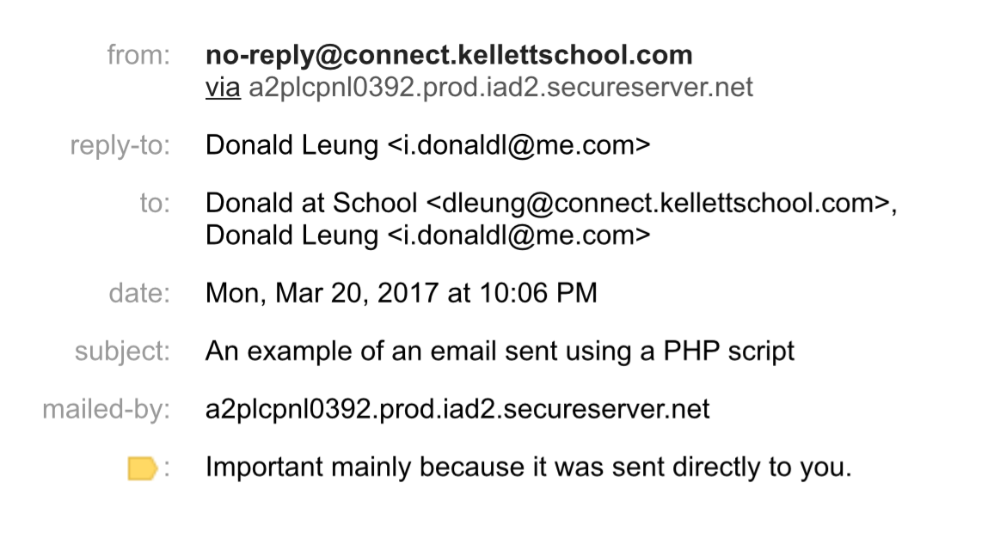
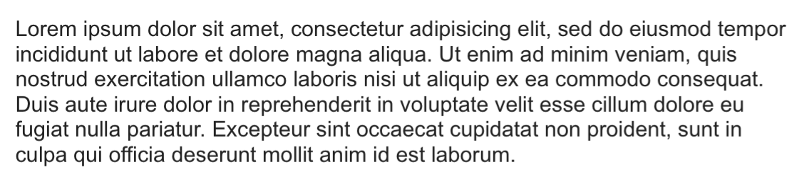
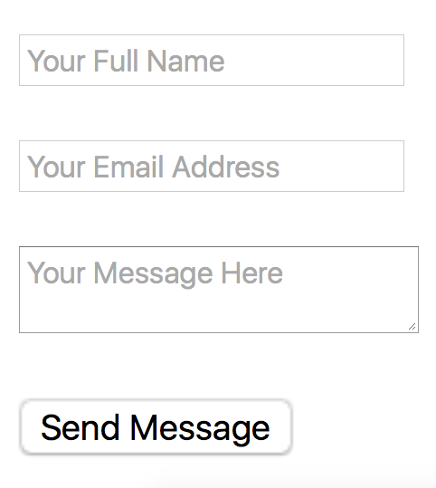

# PHP in Action #4 - Mailing Scripts
## 6 kyu

###About this Kata Series

"PHP in Action" is a Kata Series authored by donaldsebleung which is specifically aimed at novice PHP programmers who have learnt the basic syntax and features of the PHP programming language in online courses such as Codecademy but do not know how to apply it in real-world situations. Hence, this Kata Series will focus on the practical aspects of PHP such as sending emails, form validation and setting cookies.

This Kata Series assumes that you have already learnt the fundamentals of PHP such as data types (e.g. strings, numbers, booleans), functions and basic OOP. A good indicator that you are ready for this Kata Series is if you can complete Multiply (8kyu) in PHP and the first four Kata in my Object-Oriented PHP Series without hesitation and without referring to external sources in the process. Since real-world PHP is commonly used in conjunction with HTML and CSS (and sometimes even Javascript), you will also be expected to have a basic understanding of the following programming languages. In certain Kata in this Series where form validation is involved, you may also be expected to be familiar with HTML forms, what attributes they have and how they work.

### Lesson

In PHP, the most direct way to send an email directly from a PHP script is found in a function in the PHP Core called ```mail()```. This function receives three required parameters and two optional parameters. Note that each of the parameters in ```mail()``` must adhere to certain strict (predefined) formats and that the 2 optional parameters in ```mail()``` are not very well documented (as far as I know):

1. ```$to``` - **Required**. The email address(es) which will receive the email specified in the form of a string. The string provided must comply to RFC 2822 standards. Some examples include a single valid email address (e.g. ```johndoe@example.tld```), the name of the recipient followed by his/her email address in angled brackets (e.g. ```John Doe <johndoe@example.tld>```), a list of valid email addresses each separated by a comma and space (e.g. ```johndoe@example.tld, janedoe@example.tld, johnanderson@example.tld, janeanderson@example.tld```) and a list of valid email addresses along with their names (e.g. ```John Doe <johndoe@example.tld>, Jane Doe <janedoe@example.tld>```).
1. ```$subject``` - **Required**. The subject of the email being sent (as a string). The official website on PHP states that this must comply to RFC 2047 standards but to be honest, any ordinary email subject will be valid.
1. ```$message``` - **Required**. The actual body of the email (as a string). The official website on PHP states that each line of the email message ***must not exceed 70 characters*** and that each line ***should be separated from the next by a CRLF (\r\n)*** but actual testing shows that this wrapping of the $message is not required (i.e. each line can exceed 70 characters). Nevertheless some may consider it best practice to properly wordwrap and format the email message before passing it through ```mail()``` to be sent.
1. ```$additional_headers``` - **Optional**. Specifies any optional headers that should go into the email being sent (as a string if provided). This should be properly formatted if provided, each additional header in the form ```Header-name: corresponding-value``` and each header separated from the next by a`` CRLF (\r\n)``. Common additional headers provided include``` "From"``` and ```"Reply-to"``` (so the recipient can actually reply to a valid email address). Other headers can also be set; for example a specific header allows you to send HTML emails (but it is outside the scope of this course)
1. ```$additional_parameters``` - **Optional**. This optional parameter is not well documented in the official website on PHP and W3Schools so it is up to you to discover what it does in your spare time. We will not cover this optional argument in this Kata.

For example, a call to ```mail()``` with the following arguments:
```
mail(
  "Donald at School <dleung@connect.kellettschool.com>, Donald Leung <i.donaldl@me.com>",
  "An example of an email sent using a PHP script",
  "Lorem ipsum dolor sit amet, consectetur adipisicing elit, sed do eiusmod tempor incididunt ut labore et dolore magna aliqua. Ut enim ad minim veniam, quis nostrud exercitation ullamco laboris nisi ut aliquip ex ea commodo consequat. Duis aute irure dolor in reprehenderit in voluptate velit esse cillum dolore eu fugiat nulla pariatur. Excepteur sint occaecat cupidatat non proident, sunt in culpa qui officia deserunt mollit anim id est laborum.",
  "From: no-reply@connect.kellettschool.com\r\nReply-to: Donald Leung <i.donaldl@me.com>"
);
```

... would send an email with the following headers:



... and the following message body:



**NOTE:** *The owners of any and all email addresses displayed in the code example above have been notified and have granted permission to the author of this Kata to use their email addresses in this example for purely educational purposes.*

You may also want to read up on the official documentation on mail() and that on W3Schools to gain a better understanding before attempting this Kata.

#### Regarding Wordwrap in PHP

If you decide to follow best practices and properly wordwrap your email messages before sending them via ```mail()```, please note that there is no need to implement the algorithm yourself as PHP has a built-in ```wordwrap()``` function that does just that.

### Task

*Note: The lesson provided in this Kata is designed to teach you most, if not all, of the key concepts required to complete the Task in this Kata. However, if in doubt, you are strongly encouraged to conduct your own research.*

#### Preloaded

Since we don't want to actually send out emails in this Kata (that would be disastrous!) and since built-in functions are almost impossible to override in PHP, a final Kata class has been preloaded for you with a class (static) method ```mail()``` which is somewhat similar to the actual ```mail()``` function in terms of its argument list. For example, in the code example displayed in the lesson in this Kata, that would be written as the following in this Kata only:
```
Kata::mail(
  "Donald at School <dleung@connect.kellettschool.com>, Donald Leung <i.donaldl@me.com>",
  "An example of an email sent using a PHP script",
  "Lorem ipsum dolor sit amet, consectetur adipisicing elit, sed do eiusmod tempor incididunt ut labore et dolore magna aliqua. Ut enim ad minim veniam, quis nostrud exercitation ullamco laboris nisi ut aliquip ex ea commodo consequat. Duis aute irure dolor in reprehenderit in voluptate velit esse cillum dolore eu fugiat nulla pariatur. Excepteur sint occaecat cupidatat non proident, sunt in culpa qui officia deserunt mollit anim id est laborum.",
  "From: no-reply@connect.kellettschool.com\r\nReply-to: Donald Leung <i.donaldl@me.com>"
);

```

#### Warm Up

Before we do actual form-validation and the like, let's first warm up by sending an email without using any forms. This email should be sent to exactly 2 recipients, the first one being **John Doe** with email address **johndoe@example.tld** and the second one being **Jon Snow** with the email address **jonsnow@example.com** in the given order. Please format this string exactly as demonstrated in the Lesson above. The subject of this email message is **"Hello John Doe and Jon Snow"** and the body of this email is **"Hello John and Jon,\r\n\r\nJust wanted to say hi :)\r\n\r\nCheers,\r\nJane Doe"**. As for additional headers, set the **"From"** header to **no-reply@example.tld** and the **"Reply-to"** header to **jane1234@example.com** in the given order. The headers must be formatted exactly as demonstrated in the Lesson above and note that every colon is followed by a whitespace character for every single header, i.e. **From: some-email@example.tld** is considered a valid header and **From:some-email@example.tld** is considered **INVALID**. The names of each header are also case-sensitive for the purposes of this Kata so **from: some-email@example.tld** will NOT pass the tests.

### Main Task

The contact form you are about to power (using PHP) has the following HTML code:
```html
<form action="<?php echo htmlspecialchars($_SERVER["PHP_SELF"]); ?>" method="post">
  <p>
    <input type="text" name="name" placeholder="Your Full Name" />
  </p>
  <p>
    <input type="email" name="email" placeholder="Your Email Address" />
  </p>
  <p>
    <textarea name="message" placeholder="Your Message Here"></textarea>
  </p>
  <p>
    <input type="submit" value="Send Message" />
  </p>
</form>
```

... and has the following appearance:



In your ```user_script()``` function, write a PHP script that does the following:

1. Checks whether the visitor landed on the form page by visitation or form submission - if the visitor landed on the form page without submitting the actual form then don't do anything. Refer to Kata #3 in this Series if in doubt.
1. Confirms that all fields in the HTML form shown above are not empty - if any of them are empty then print the string ```<p><span style=\"color: red\">All fields are required</span></p>``` and do not do anything else
1. Checks that the format of the name provided in the name field of the HTML form is valid by using the following regular expression: ```/^[a-z]+( [a-z]+)*$/i```. We don't want the visitor to mess up our mailing script by entering in an invalid name! If you haven't come across ```preg_match()``` already you may want to read it up here. Note that for this Kata you will only ever need to pass in the first two (required) arguments into ```preg_match()```. If the name is invalid then print the following string to the visitor and do not do anything else: ```"<p><span style=\"color: red\">Your name must contain only alphabets and whitespace</span></p>"```
1. Using ```filter_var() or otherwise```, confirm that the email address provided in the email field of the HTML form is a valid email address. If that is not the case print ```"<p><span style=\"color: red\">Email Address is Invalid</span></p>"``` and don't do anything else.
1. Now that you have validated all necessary fields in your contact form, use the form data to send an email with the following arguments: you are to send the email message to your_email_address@example.tld, set the email subject to "Private Message from my Personal Website", set the email body to the form data entered in the message field of your HTML form and set both the "From" and "Reply-to" headers to the name-address pair in the following format: NAME_FROM_FORM_DATA <EMAIL_ADDRESS_FROM_FORM_DATA>. Make sure to set the "From" and "Reply-to" headers IN THE GIVEN ORDER and don't forget that it is CASE SENSITIVE for the purposes of this Kata. Also make sure you format the headers EXACTLY as demonstrated in the lesson above; otherwise, you will NOT pass the tests. Finally, as a confirmation to the visitor that the email has been sent, print the following message: "<p><span style=\"color: green\">Message Sent</span></p>"
