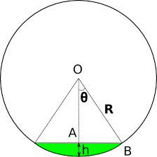

# Tank Truck
## 6 kyu

To introduce the problem think to my neighbor who drives a tanker truck. The level indicator is down and he is worried because he does not know if he will be able to make deliveries. We put the truck on a horizontal ground and measured the height of the liquid in the tank.

Fortunately the tank is a perfect cylinder and the vertical walls on each end are flat. The height of the remaining liquid is ```h```, the diameter of the cylinder base is ```d```, the total volume is ```vt``` (h, d, vt are positive or null integers). You can assume that h <= d.

Could you calculate the remaining volume of the liquid? Your ```function tankvol(h, d, vt)``` returns an integer which is the truncated result (e.g floor) of your float calculation.

### Examples:
```
tankvol(40,120,3500) should return 1021 (calculation gives about: 1021.26992027)

tankvol(60,120,3500) should return 1750

tankvol(80,120,3500) should return 2478 (calculation gives about: 2478.73007973)
```
Tank vertical section:

